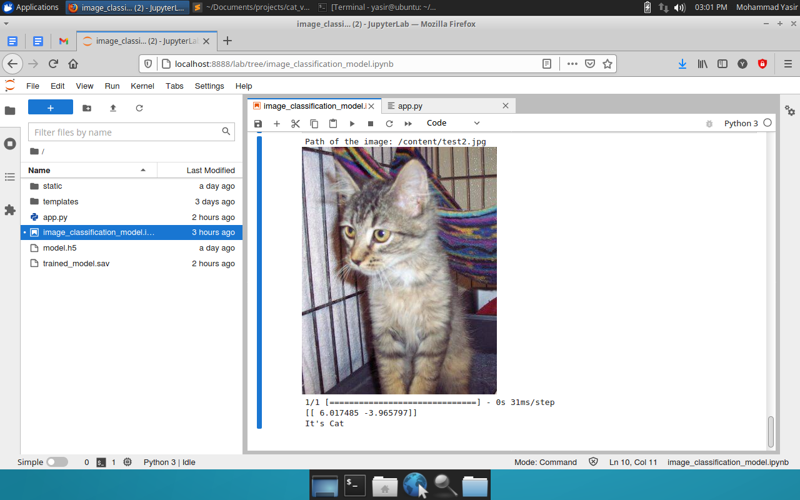

# Cat vs Dog Classifier using Transfer Learning

Develop a Image Classification Model for Cat vs Dog Classification with Transfer Learning (MobileNetV2). This work proposes an image classification model to distinguish between cats and dogs. We leverage transfer learning by utilizing a pre-trained MobileNetV2 model as the base architecture. MobileNetV2, trained on a large-scale image dataset ImageNet, has learned generic image features. By fine-tuning the pre-trained model on a dataset of cat and dog images.

 

By leveraging the pre-trained MobileNetV2, we achieve two key benefits: faster training and potentially higher accuracy. The pre-trained model provides a strong foundation of generic image features learned from ImageNet. Fine-tuning allows this foundation to specialize in cat vs. dog classification, potentially leading to more accurate predictions compared to training a model from scratch.

